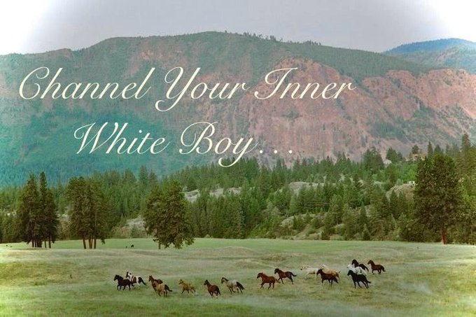
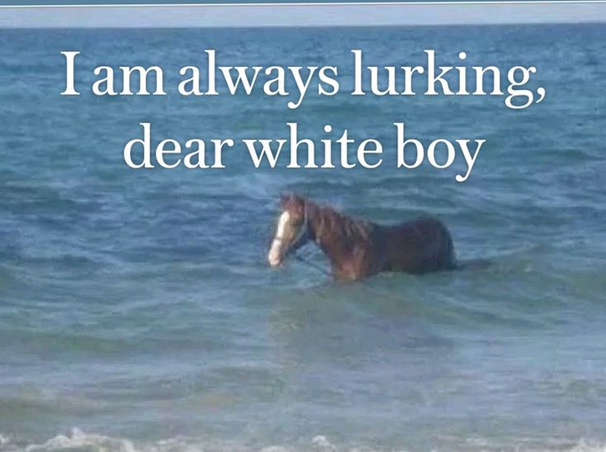

# hello... white boy

hiii :3 as a funny ongoing bit with oomfs, we can't stop saying white boy.

i thought it would be funny to create a discord bot with the sole purpose of sharing white boy
inspiration images every single day. Credit to twitter user [@DragonOomf_Meh](https://x.com/DragonOof_Meh) for creating a [thread](https://x.com/DragonOof_Meh/status/1997563195217821983?s=20) of many white boy horse images.

as i am writing this, i am nowhere near certain that i any of this works (primarily the delivering of whiteboy images at 6am) so hopefully this works when i believe it should

## How to use the bot

You can start by adding it to your discord bot bot here [[Auth Link](https://discord.com/oauth2/authorize?client_id=1462639859578703990&scope=bot&permissions=414464723968)]. There are three commands that we recommend
that each user runs when first installing the discord bot.

1. `/whiteboysetup channel <@channel>` - This will set the designated channel that your white boy images will go into
2. `/whiteboy timezone <timezone>` - This will setup the timezone that lets the bot figure out when it should send these images, They are typically sent at around 6am every single day. You can find a list of all available
   timezones [here](https://en.wikipedia.org/wiki/List_of_tz_database_time_zones#List)
3. `/whiteboy role <@role>` - If you would like to @ people when a new image has been delivered, You can change the role here, set it to @everyone if you really hate your community.

## To-do list

- Allow users to generate their own white boy images at whim.
- Prevent duplicate white boy images being sent
- (Possible) a way to submit whiteboy images to the discord bot to help keep the supply

## be well... white boy

